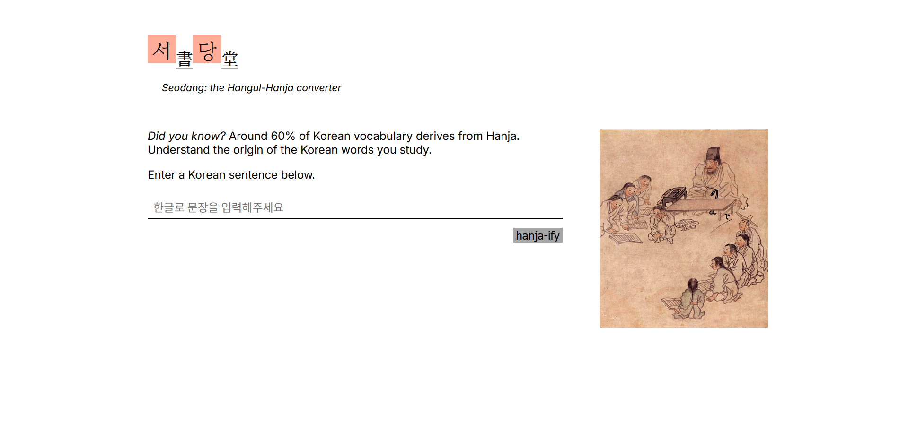
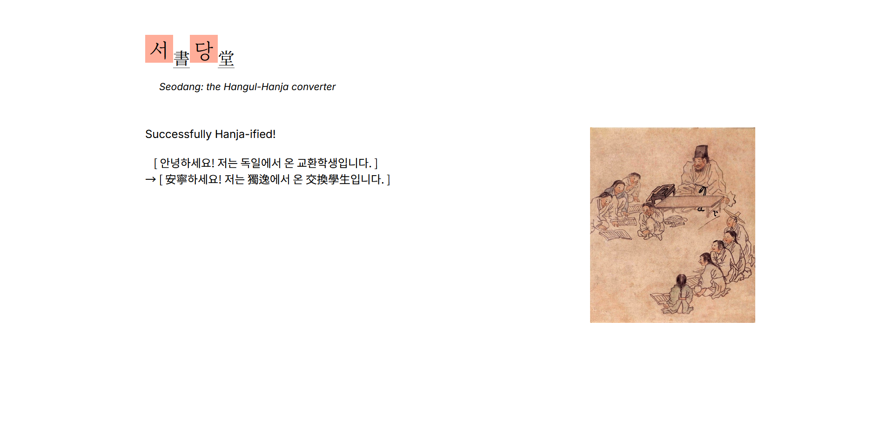

### Seodang

Have you ever felt overwhelmed trying to memorize Korean words? Learn Korean more effectively with Hanja. Up to 60% of Korean vocabulary are derived from Hanja. Seodang is a web application built with Django to help you on your Korean learning journey. Try entering any Korean sentence, and see which words have their origin in Hanja.





### Installation

Start a virtual environment in your terminal. 

```
pipenv shell
```

install necessary packages. 

```
pip install -r requirements.txt
```

The Seodang/settings.py file depends on an .env file. Create one in the root directory. You'll need keys for both Django and Korean Learners' Dictionary API. For Django, simply follow 

```
python -c 'from django.core.management.utils import get_random_secret_key; print(get_random_secret_key())'
```

And for the Korean Learners' Dictionary API, you'll have to visit their [Open API link](https://krdict.korean.go.kr/openApi/openApiInfo) and follow instructions there. 

You'll have to migrate settings for the SQLite database, which you can do with


```
python manage.py makemigrations
```

And then finalize it with 


```
python manage.py migrate
```

Finally, run it in your local server with 


```
python manage.py runserver
```

### Acknowledgments

The picture used is of the late 18th century painting by Joseon dynasty painter Kim Hong-Do, titled *Seodang*.  

KoNLPy was essential for the natural language processing aspect of this project. Attributions are as follows: 

- Eunjeong L. Park, Sungzoon Cho. “KoNLPy: Korean natural language processing in Python”, Proceedings of the 26th Annual Conference on Human & Cognitive Language Technology, Chuncheon, Korea, Oct 2014.

